# NATURA

Sistem pelaporan sampah berbasis poin yang menghubungkan masyarakat, admin, petugas kebersihan, dan UMKM dalam satu ekosistem digital untuk mewujudkan lingkungan yang lebih bersih dan berkelanjutan.

**Kompetisi:** ITechno Cup 2026 — Web Development (Kategori Mahasiswa)
**SDG yang diimplementasikan:** SDG 11
Kota dan Komunitas Berkelanjutan Kota dan Komunitas Berkelanjutan. Melalui solusi digital yang
mendukung layanan publik, mobilitas, lingkungan, dan kehidupanmasyarakat yang lebih cerdas serta inklusif.


**Live Demo:** [naturaleaf.netlify.app](https://naturaleaf.netlify.app)

---

## DEMO & TANGKAPAN LAYAR


### Tampilan Login / Register & Notif
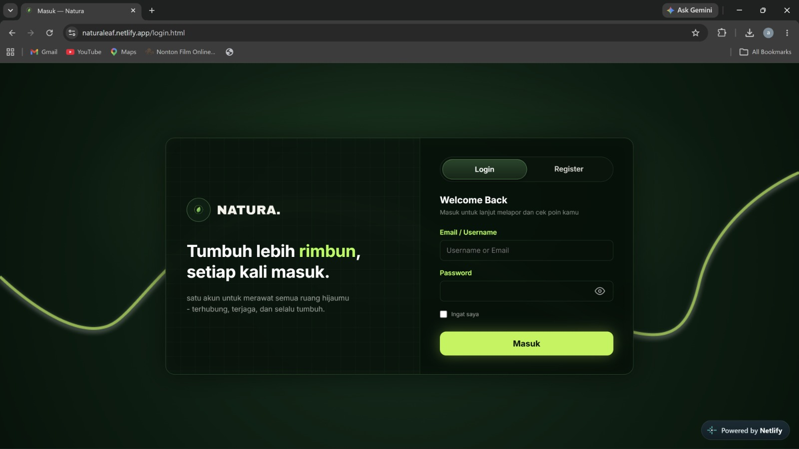
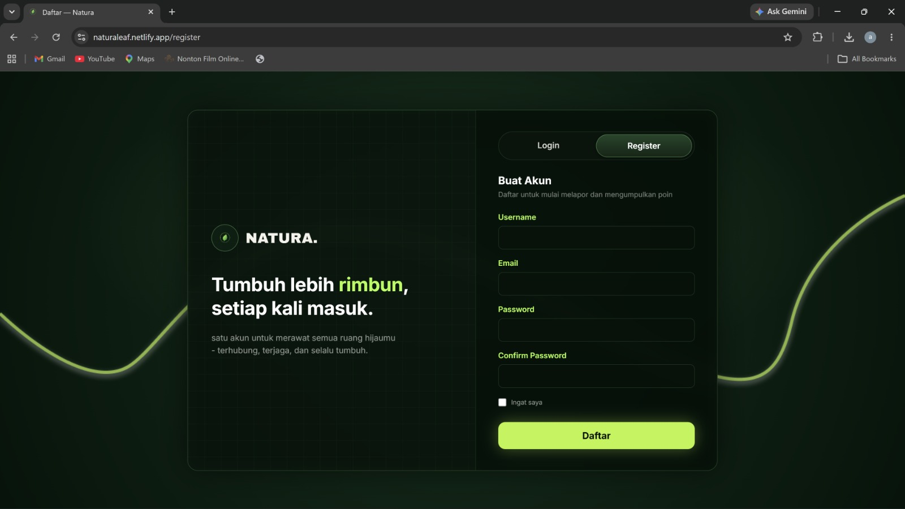
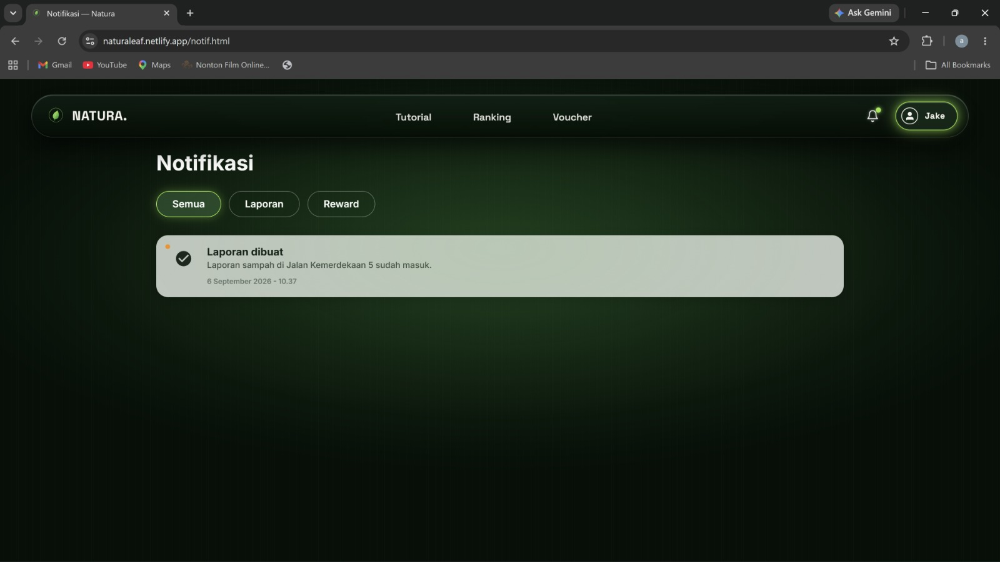


### MEMBER
Username: (Bebas (Buat akun terlebih dahulu))
Password: (Bebas (Buat akun terlebih dahulu))


### Tampilan Homepage
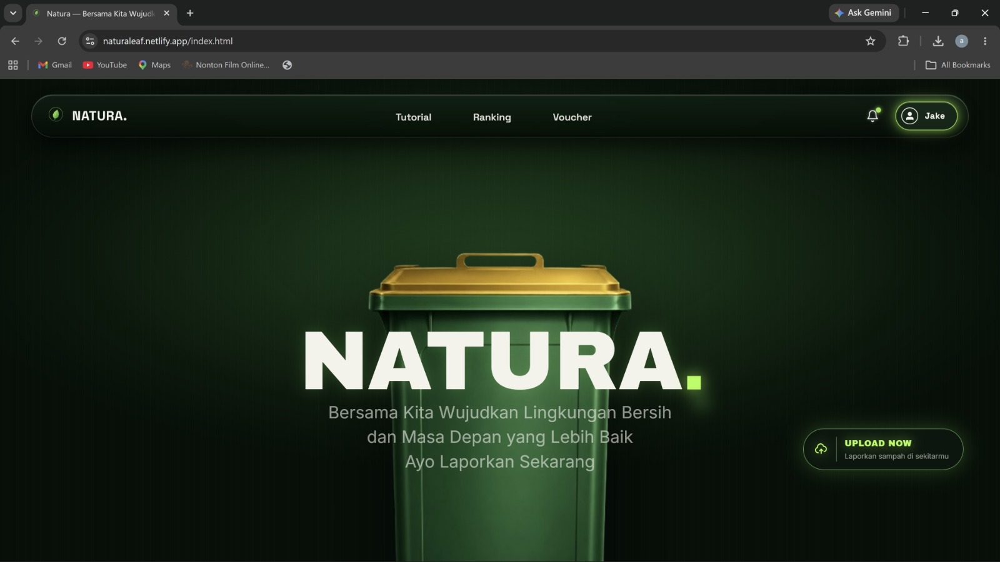
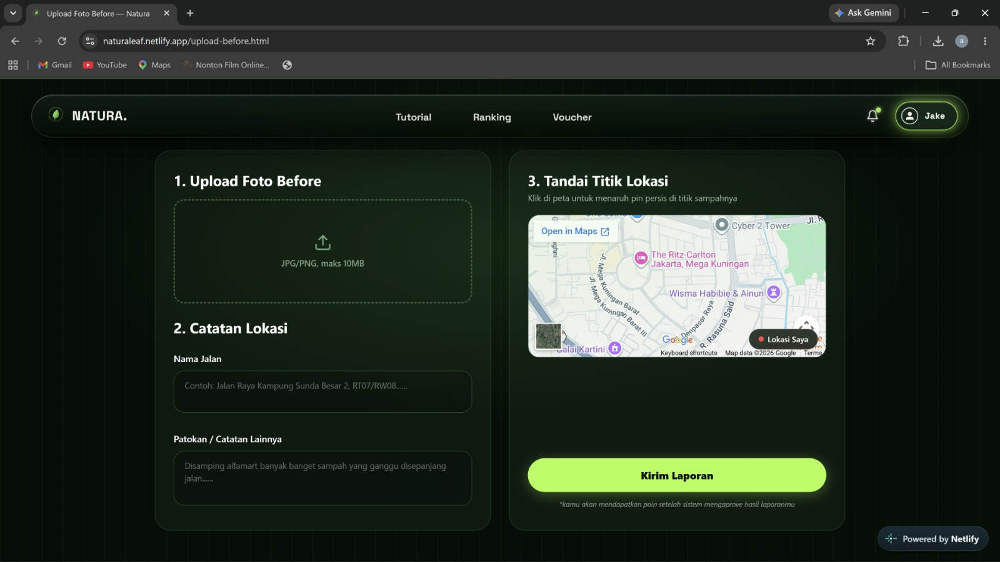

### Tampilan Tutorial
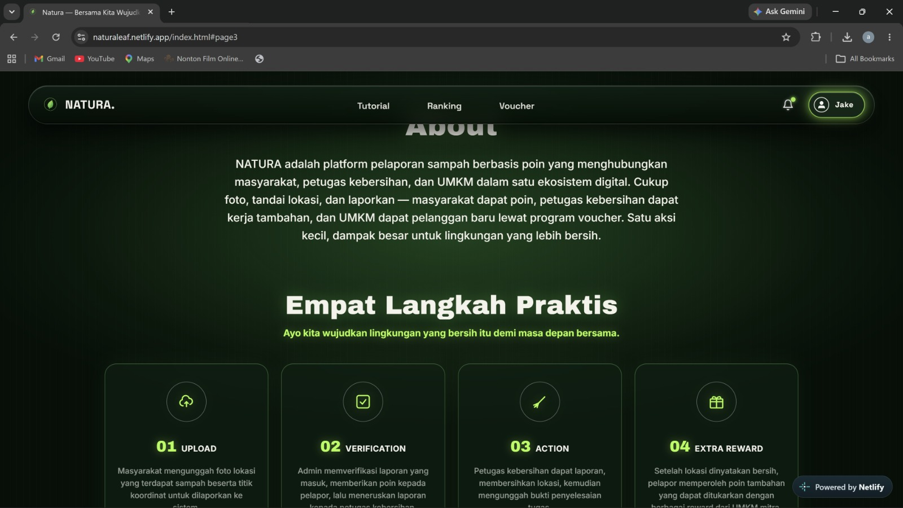

### Tampilan Ranking
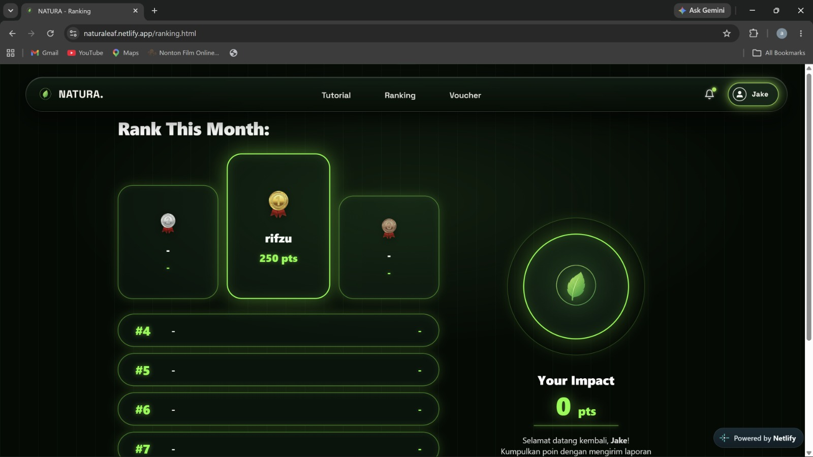

### Tampilan Voucher
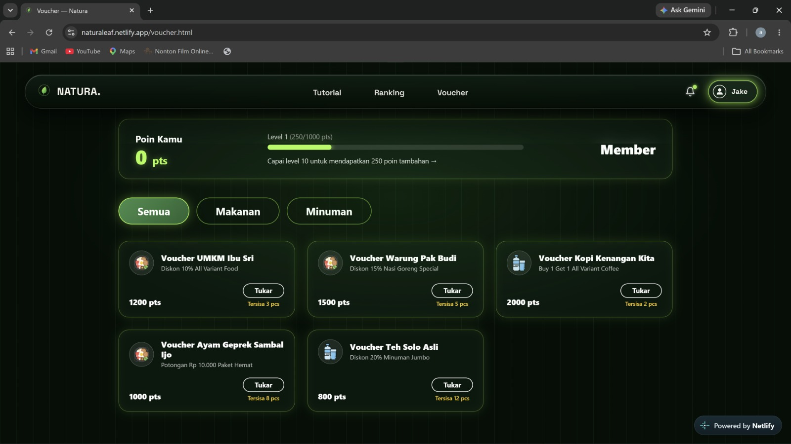
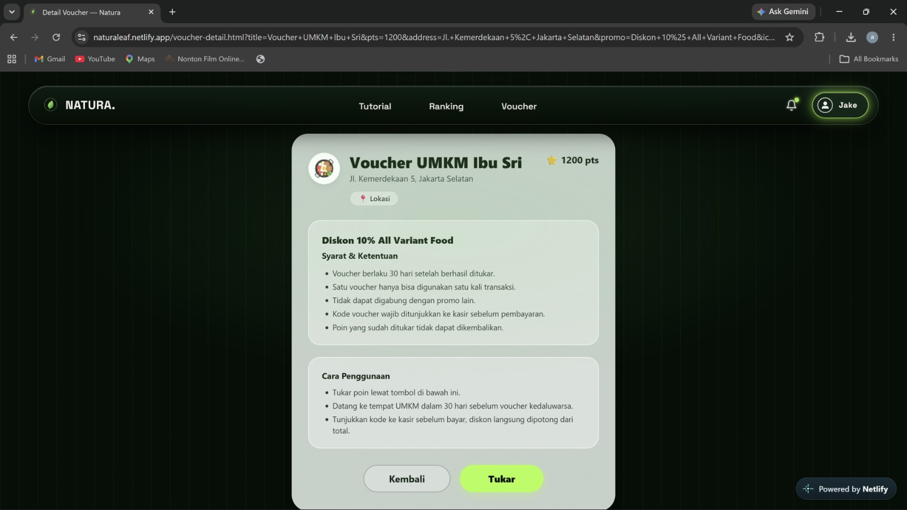
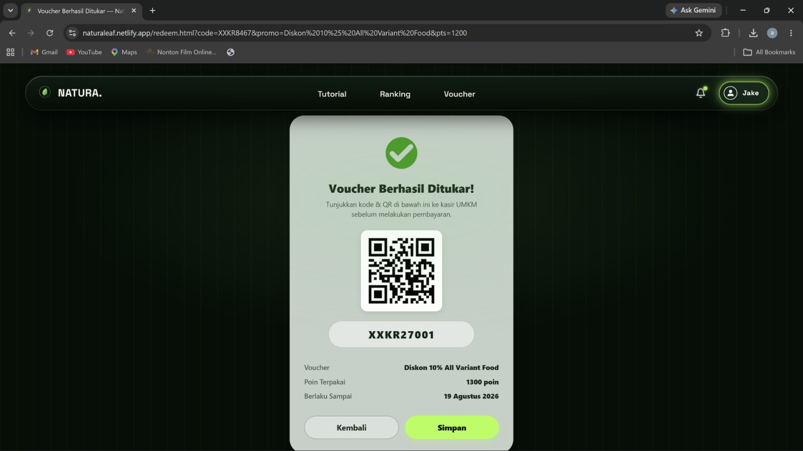

### Tampilan Profile
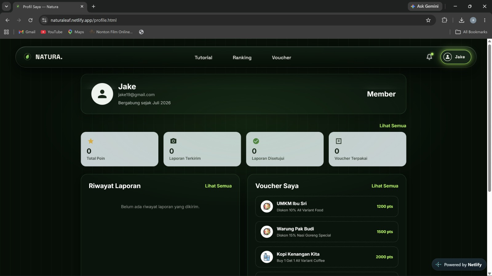


### ADMIN
Username: admin
Password: admin123


### Tampilan Dashboard
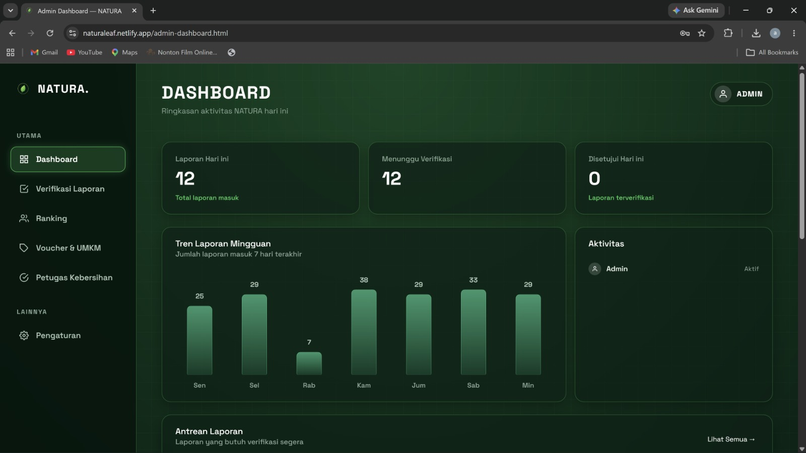
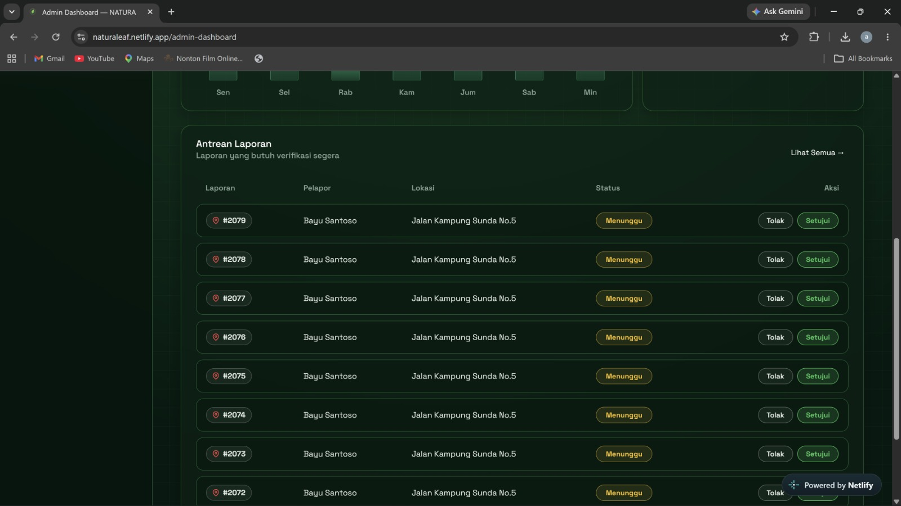

### Tampilan Verifikasi Laporan


### Tampilan Ranking
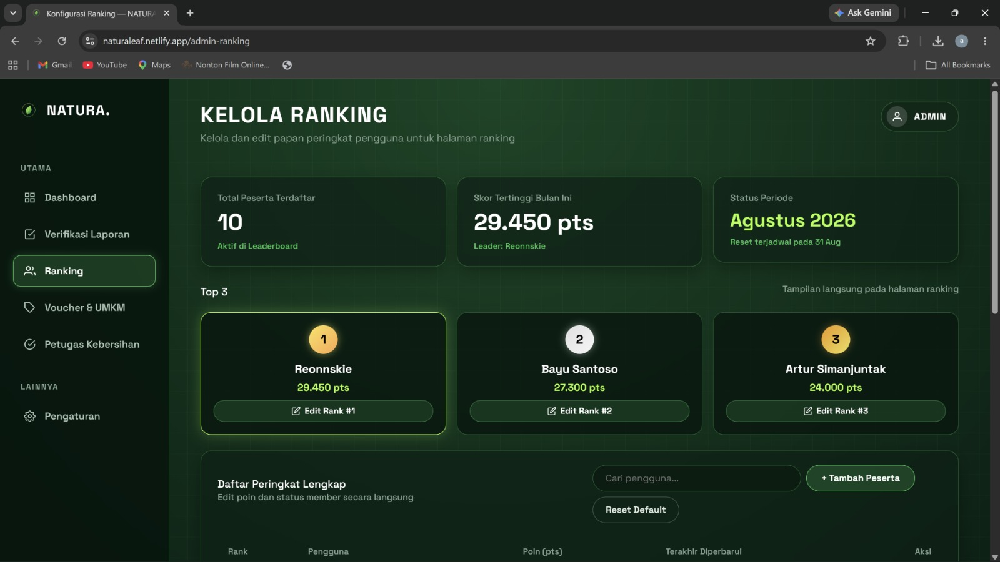
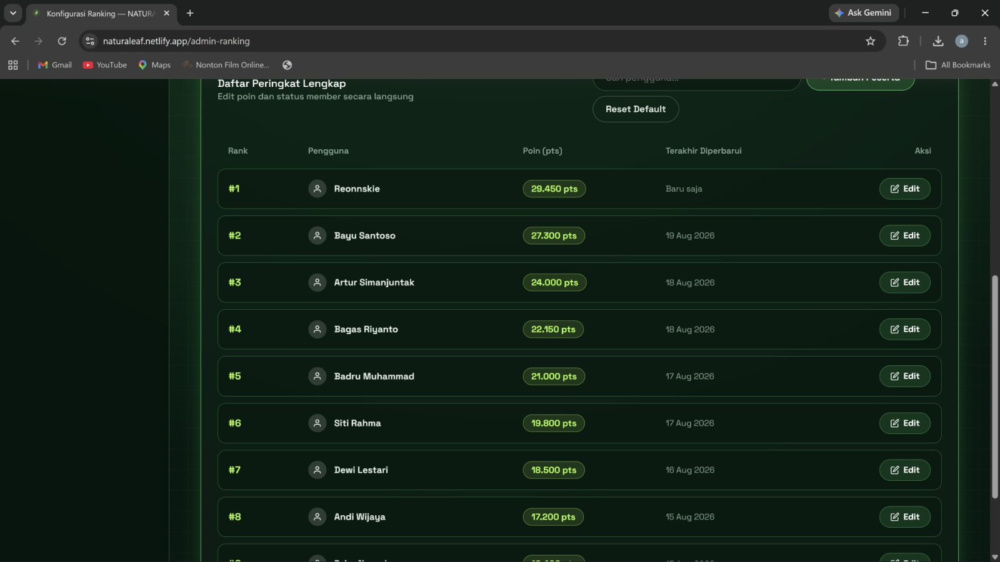
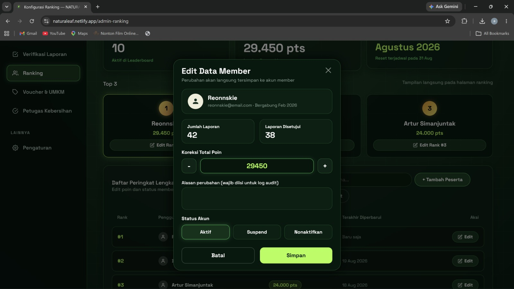

### Tampilan Voucher & UMKM


### Tampilan Petugas Kebersihan


### Tampilan Pengaturan
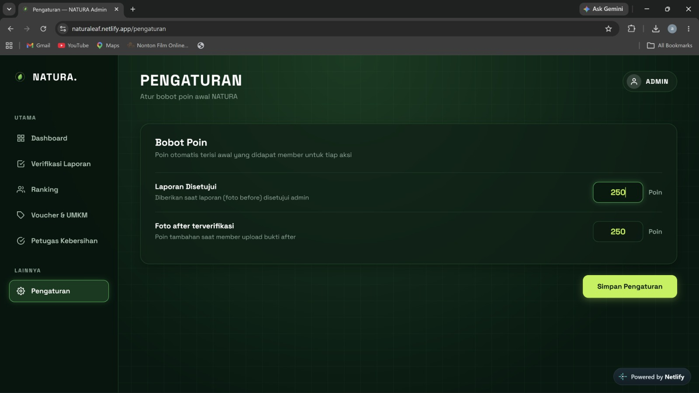

### Video Demo (opsional)
https://drive.google.com/drive/folders/1UfU7UpvafUe66DgUqFBbJDHbjvHn-lwi

---

## 1. Penjelasan Aplikasi

### Latar Belakang
Sampah yang berserakan di lingkungan sekitar sering dibiarkan begitu saja karena tidak ada mekanisme pelaporan yang mudah diakses, dan tidak ada insentif bagi masyarakat untuk ikut berpartisipasi menjaga kebersihan. Di sisi lain, petugas kebersihan sering tidak mengetahui titik-titik sampah di luar rute rutin mereka, sementara UMKM di sekitar lingkungan tersebut kesulitan menjangkau pelanggan baru.

### Tujuan
NATURA hadir untuk membantu ketiga persoalan ini melalui satu platform digital yang menghubungkan:
- **Masyarakat** — melaporkan titik sampah dan mendapatkan poin sebagai insentif
- **Admin** — memverifikasi laporan dan mengelola sistem
- **Petugas Kebersihan** — menerima penugasan dan menindaklanjuti laporan
- **UMKM** — menyediakan voucher reward yang bisa ditukar masyarakat dengan poin

Solusi ini memenuhi dengan **SDG 11** melalui pengelolaan sampah berbasis komunitas, dan juga pemberdayaan ekonomi UMKM lokal serta penciptaan peluang kerja tambahan bagi petugas kebersihan.

---

## 2. Fitur Utama

### Untuk Masyarakat (Member)
- Pelaporan titik sampah dengan foto before + penandaan lokasi di peta
- Verifikasi 2 tahap: laporan awal (before) → tindak lanjut petugas (after)
- Sistem poin otomatis untuk setiap laporan yang diverifikasi
- Ranking/leaderboard kontributor
- Penukaran poin dengan voucher UMKM mitra

### Untuk Admin
- Dashboard ringkasan aktivitas (laporan masuk, verifikasi, poin terdistribusi)
- Verifikasi laporan 2 tahap (foto before → assign petugas → konfirmasi foto after)
- Manajemen ranking & koreksi poin manual
- Manajemen voucher & pendaftaran UMKM mitra
- Manajemen & penugasan petugas kebersihan
- Pengaturan bobot poin sistem

---

## 3. Teknologi yang Digunakan

| Kategori      |Teknologi      | Keterangan |

| Frontend      |HTML           |Struktur dasar seluruh halaman |
| Styling       |CSS & Bootstrap|Bootstrap digunakan untuk grid system dan komponen responsif |
| Interaktivitas|JavaScript     |Menangani logika interaktifsisi client (validasi form, interaksi UI) |
| Peta Lokal    |Google Maps API|Digunakan untuk menandai dan menampilkan titik lokasi laporan sampah |
| Autentikasi   |JavaScript     |
| Hosting       |Netlify        |

---

## Struktur Folder

```
natura/
├── admin-dashboard.html
├── admin-ranking.html
├── bin-glow.png
├── bronze medalpng
├── bin.png
├── cek-laporan-admin.html
├── checkmarkicon.png
├── detail-laporan.html
├── download(11)2.png
├── giant leaf.png
├── gold medal.png
├── grid.png
├── hot-pot 2.png
├── index.html
├── leaf logo.png
├── login.html
├── logo.png
├── navbar-loader.js
├── notif.html
├── pengaturan.html
├── petugas-kebersihan.html
├── profile.html
├── ranking.html
├── rankingexample.html
├── redeem.html
├── register.html
├── report-verif.html
├── silver medal.png
├── style.css
├── upload-before.html
├── upload.html
├── voucher-detail.html
├── voucher-umkm.html
├── vector 39.png
├── voucher.html
├── logout-modal.html
└── water-bottel 2.png


```

---

## 4. Cara Penggunaan

### Alur Penggunaan Singkat
1. Registrasi/login sebagai Member
2. Buat laporan titik sampah (upload foto before + tandai lokasi)
3. Admin memverifikasi laporan → poin diberikan → petugas ditugaskan
4. Petugas menyelesaikan tugas & upload foto after
5. Admin konfirmasi selesai → poin tambahan diberikan
6. Member menukar poin dengan voucher UMKM di halaman Voucher

Catatan: Upload foto after akan muncul setelah 1 menit dari laporan disetujui demi mempercepat demonstrasi fungsional Web NATURA

---

## Tautan Proyek

- **Repository GitHub:** *(https://github.com/SylvisX/Natura-Website#natura-website)*
- **Live Demo (Hosting):** https://naturaleaf.netlify.app

---

## Tim - MRLP

1. Ahmad Zhafran Antoni - Politeknik Negeri Jakarta
2. Muhammad Rifqy Zuhair Marpaung - Binus University

